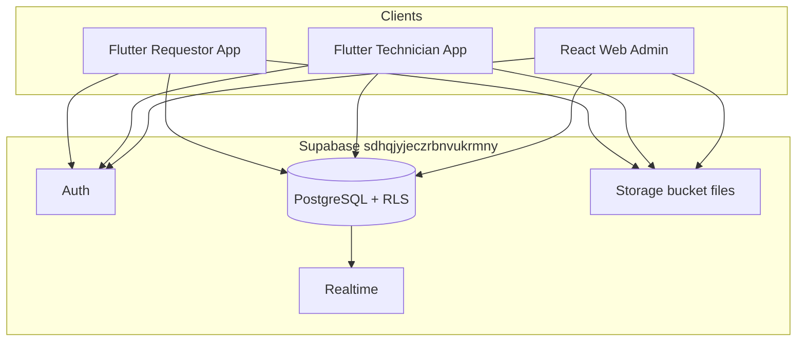

# Be Electric CMMS — Mobile Apps Handbook for React Admin Developers

**Audience:** React / Next.js admin (`beelectric-react`, `qauto-cmms-web`) developers  
**Authors:** Product & engineering handoff (PM + tech lead perspective)  
**Last updated:** June 2026  
**Supabase project:** `sdhqjyjeczrbnvukrmny` (`https://sdhqjyjeczrbnvukrmny.supabase.co`)

---

## Table of contents

1. [Purpose of this document](#1-purpose-of-this-document)
2. [Product overview](#2-product-overview)
3. [Monorepo architecture](#3-monorepo-architecture)
4. [Shared backend contract](#4-shared-backend-contract)
5. [Authentication, roles, and provisioning](#5-authentication-roles-and-provisioning)
6. [Data models reference](#6-data-models-reference)
7. [Requestor mobile app](#7-requestor-mobile-app)
8. [Technician mobile app](#8-technician-mobile-app)
9. [Admin surfaces in Flutter vs React](#9-admin-surfaces-in-flutter-vs-react)
10. [Work orders — end-to-end lifecycle](#10-work-orders--end-to-end-lifecycle)
11. [Preventive maintenance (PM tasks)](#11-preventive-maintenance-pm-tasks)
12. [Inventory and parts requests](#12-inventory-and-parts-requests)
13. [Be Electric Support requests](#13-be-electric-support-requests)
14. [Storage and attachments](#14-storage-and-attachments)
15. [Realtime and caching](#15-realtime-and-caching)
16. [Notifications](#16-notifications)
17. [Analytics and reporting](#17-analytics-and-reporting)
18. [RLS and RPC reference](#18-rls-and-rpc-reference)
19. [React admin build checklist](#19-react-admin-build-checklist)
20. [Known gaps, doc drift, and troubleshooting](#20-known-gaps-doc-drift-and-troubleshooting)
21. [Verification commands](#21-verification-commands)
22. [Source code index](#22-source-code-index)
23. [Related documents in this repo](#23-related-documents-in-this-repo)

---

## 1. Purpose of this document

This handbook describes **everything the React admin needs to know** about the two Flutter mobile apps and the shared Supabase backend they consume. It is written so a web developer can:

- Provision users, companies, and assets correctly
- Display the same data mobile users create and update
- Build admin workflows (assignment, support inbox, parts approval, PM scheduling) without guessing schema or business rules
- Debug RLS and visibility issues that appear as “missing work orders” or empty lists in mobile

**What this is not:** a Flutter build guide. For store release and `--dart-define` flags, see `docs/STORE_RELEASE.md`.

**Golden rule:** `public.users.id`, `work_orders.requestorId`, and `support_requests.createdBy` are **text** and must equal `auth.uid()::text`. Almost every RLS failure traces back to breaking this rule.

---

## 2. Product overview

Be Electric CMMS is a **B2B** maintenance platform for organizations operating EV charging equipment. Accounts are created by administrators; there is no public self-registration.

### Client applications

| Client | Package | Store bundle ID | Allowed roles |
|--------|---------|-----------------|---------------|
| **Requestor app** | `apps/requestor_cmms` | `com.beelectric.cmms.requestor_cmms` | `requestor` only |
| **Technician app** | `apps/technician_cmms` | `com.beelectric.cmms.technician_cmms` | `technician`, `manager`, `admin` |
| **React web admin** | Separate repo (`beelectric-react` / `qauto-cmms-web`) | N/A | `admin`, `manager`, and optionally `requestor` web flows |

### Role responsibilities (business view)

| Role | Primary job | Mobile app | React admin |
|------|-------------|------------|-------------|
| **Requestor** | Report charger issues, track tickets, submit Know How / Commissioning support | Requestor app | Optional web “create request / my requests” |
| **Technician** | Execute assigned work orders and PM tasks, request parts, complete with signature | Technician app | Not on web (field role) |
| **Manager** | Operate the business: assign work, approve parts, manage inventory, view analytics | Technician app **or** React (Flutter still ships `AdminMainScreen`) | Primary surface |
| **Admin** | Full system configuration: users, companies, assets, settings | Technician app **or** React | Primary surface |

### High-level system diagram



---

## 3. Monorepo architecture

### Repository layout

| Path | Role |
|------|------|
| `packages/cmms_core` | Shared Dart library: models, services, repositories, providers, screens, assets |
| `apps/requestor_cmms` | Thin Flutter shell → `runRequestorApp()` |
| `apps/technician_cmms` | Thin Flutter shell → `runTechnicianApp()` |
| `docs/` | Feature and backend documentation |
| `scripts/` | Build scripts, DB CLI (`db.sh`), SQL migrations and verify scripts |
| `supabase/migrations/` | Recent migrations (support, PM RLS, inventory RLS, orphan prevention) |

### Bootstrap chain (both apps)

```
main.dart (app shell)
  → packages/cmms_core/lib/bootstrap/app_entrypoints.dart
    → initializeCmms()          // Supabase, GetIt service locator, repositories
    → BeElectricApp(appMode: requestor | technician)
      → AuthWrapper
        → RequestorSplashScreen (requestor only, 3s)
        → checkAuthStatus()
        → RoleBasedNavigation OR LoginScreen
```

Key files:

- `packages/cmms_core/lib/bootstrap/cmms_bootstrap.dart`
- `packages/cmms_core/lib/app/be_electric_app.dart`
- `packages/cmms_core/lib/widgets/role_based_navigation.dart`
- `packages/cmms_core/lib/utils/app_role_policy.dart`

### Client architecture pattern

Every feature follows the same stack:

```
Screen
  → Provider (ChangeNotifier)
    → Service (business logic)
      → Repository (interface)
        → SupabaseDatabaseService / SupabaseStorageService / SupabaseAuthService
          → Supabase (Postgres + Storage + Auth)
```

Provider wiring: `packages/cmms_core/lib/providers/cmms_provider_bundle.dart`

Repository registry: `packages/cmms_core/lib/repositories/cmms_repositories.dart`

Dependency injection: `packages/cmms_core/lib/config/service_locator.dart` (GetIt)

### Assets

UI images live in `packages/cmms_core/assets/`. Shell apps load them via `package: kCmmsCoreAssetPackage` — they are **not** duplicated in each app’s `assets/` folder.

---

## 4. Shared backend contract

### Database conventions

| Convention | Detail |
|------------|--------|
| Column naming | **camelCase** in Postgres (`requestorId`, `assignedTechnicianIds`, `createdAt`) — matches Dart `toMap()` |
| Primary keys | Text UUIDs for `users`, `companies`, `work_orders`; some tables use uuid type for `support_requests.id` |
| JSONB `metadata` | Used for fields not yet promoted to columns: completion photo arrays, reopen history, PM checklist, app-specific fallbacks |
| RLS helper | `get_my_role()` returns `users.role` for `auth.uid()` — required for admin/manager policies |

### Core tables

| Table | Purpose |
|-------|---------|
| `users` | App identity: email, name, role, companyId, isActive |
| `companies` | Multi-tenant organizations |
| `assets` | EV chargers and equipment (Siemens, Kostad, etc.) |
| `work_orders` | Maintenance requests / tickets |
| `pm_tasks` | Legacy preventive maintenance (frozen — maintenance-only) |
| `pm_schedules` | Option A PM schedule templates (React admin creates) |
| `pm_task_occurrences` | Option A executable PM units (assigned to technicians) |
| `inventory_items` | Parts catalog |
| `parts_requests` | Technician parts queue linked to work orders |
| `purchase_orders` | Purchase order workflow |
| `support_requests` | Know How and Commissioning support tickets |
| `notifications` | Server-side notifications (partially wired in mobile) |
| `workflows` | Approval workflows |
| `support_request_messages` | Legacy/orphaned threading table (FK dropped during support migration) |

### Recent in-repo migrations

| Migration file | Purpose |
|----------------|---------|
| `20260625120000_support_requests.sql` | Support table + requestor RLS + storage policies |
| `20260625210000_pm_tasks_technician_update_rls.sql` | Technicians UPDATE assigned PM tasks |
| `20260629120000_inventory_technician_select_rls.sql` | Technicians read inventory for parts picker |
| `20260629130000_prevent_orphan_technician_assignments.sql` | Scrub deleted users from assignment arrays |

Canonical SQL copies for manual apply: `scripts/sql/migrate_*.sql` via `./scripts/db.sh`.

---

## 5. Authentication, roles, and provisioning

### Login flow (React must mirror Flutter)

1. `supabase.auth.signInWithPassword({ email, password })`
2. Load profile via RPC **`get_user_by_email(p_email)`** — Flutter does **not** rely on direct `SELECT` from `users` at login
3. Validate:
   - Row exists in `public.users`
   - `users.id === session.user.id` (string)
   - `users.isActive === true`
   - `users.role` matches the client (requestor app rejects non-requestor roles)
4. For requestor maintenance submit: **`companyId` must be set** and company must have charger assets

Session persistence: Supabase Auth session + optional `SharedPreferences` `current_user_id` in debug builds only.

### Roles enum

From `packages/cmms_core/lib/models/user.dart` and `user_role.dart`:

```typescript
type UserRole = 'requestor' | 'technician' | 'manager' | 'admin'
```

### App-mode gates

| App | Allowed roles | Wrong role behavior |
|-----|---------------|---------------------|
| Requestor (`CmmsAppMode.requestor`) | `requestor` | `WrongAppRoleScreen` — sign out message |
| Technician (`CmmsAppMode.technician`) | `technician`, `manager`, `admin` | `requestor` → wrong app message |

Routing source: `packages/cmms_core/lib/widgets/role_based_navigation.dart`

### Role permission matrix

| Capability | Admin | Manager | Requestor | Technician |
|------------|:-----:|:-------:|:---------:|:----------:|
| React web (intended) | ✅ | ✅ | Optional | ❌ |
| View all work orders | ✅ | ✅ | Own only (`requestorId`) | Assigned only (`assignedTechnicianIds`) |
| Create maintenance request | ✅ | ✅ | ✅ (mobile + optional web) | Quick Create WO (self as requestor) |
| Assign technicians to WO/PM | ✅ | ✅ | ❌ | ❌ |
| Complete / close work orders | ✅ | ✅ | Cancel/reopen own; no field completion | Complete assigned |
| Manage users | ✅ | ✅* | ❌ | ❌ |
| Delete admin/manager users | ✅ only | ❌ | ❌ | ❌ |
| Manage companies & assets | ✅ | ✅ | ❌ | ❌ |
| Inventory CRUD | ✅ | ✅ | ❌ | Read-only catalog |
| Approve parts requests | ✅ | ✅ | ❌ | Submit only |
| PM task create (backend) | ✅ | ✅ | ❌ | RLS blocks; UI hidden for tech (T-005) |
| PM task complete | ✅ | ✅ | ❌ | Assigned tasks only |
| Support: submit | ❌ | ❌ | ✅ | ❌ |
| Support: staff reply | ✅ | ✅ | Read own + `staffReply` | ❌ |
| Analytics (global) | ✅ | ✅ | Own requests | Assigned work |

\*Manager matches admin for most permissions in client code; user deletion of admin/manager accounts is admin-only in Flutter UI.

### User provisioning checklist (React admin — **critical**)

When creating any user:

1. Create **Supabase Auth** user (email + password)
2. Copy Auth user UUID
3. Insert **`public.users`** row with:
   - `id` = Auth UUID as **string**
   - `email`, `name`, `role`, `companyId` (where applicable)
   - `isActive = true`
4. Prefer RPC **`insert_user(p_row)`** (SECURITY DEFINER) — same as Flutter admin
5. For requestors: ensure `companyId` points to a company with **Siemens/Kostad** assets or home screen blocks submission
6. For technicians: after creation, assign via `work_orders.assignedTechnicianIds` / `pm_tasks.assignedTechnicianIds`

When deleting users:

- Use RPC **`delete_user_by_id(p_id)`** — scrubs `assignedTechnicianIds` via `scrub_user_from_technician_assignments()`
- Do **not** raw-delete users without scrubbing (orphan assignments hide WOs from all live technicians)

Account deletion from mobile: mailto support flow only (`docs/account_deletion.md`) — no automated self-delete RPC from apps.

---

## 6. Data models reference

All models: `packages/cmms_core/lib/models/`. React TypeScript interfaces should mirror these shapes and **camelCase** DB columns.

### User (`user.dart`)

| Field | Type | Notes |
|-------|------|-------|
| `id` | string | Must equal `auth.uid()` |
| `email` | string | |
| `name` | string | |
| `role` | UserRole | |
| `companyId` | string? | Required for requestor flows |
| `department` | string? | |
| `isActive` | bool | |

Helpers: `isAdminOrManager`, `isTechnician`, `canCreatePmTasks` (admin/manager only)

### Company (`company.dart`)

| Field | Type |
|-------|------|
| `id`, `name`, `contactEmail`, `contactPhone`, `address` | string |
| `isActive` | bool |
| `metadata` | jsonb |

### Asset (`asset.dart`)

Key fields for admin: `id`, `name`, `location`, `manufacturer` (**Siemens** / **Kostad** for requestor home), `model`, `serialNumber`, `status`, `qrCodeId`, `companyId`, `category`

### Work order (`work_order.dart`)

**Identity:** `id`, `ticketNumber`, `idempotencyKey`

**Links:** `requestorId`, `requestorName`, `assetId`, `location`, `companyId`

**State:** `status`, `priority`, `category`

**Assignment:** `assignedTechnicianIds[]`, `primaryTechnicianId`, `assignedTechnicianId` (legacy), `technicianEffortMinutes` (jsonb map)

**Lifecycle timestamps:** `createdAt`, `assignedAt`, `startedAt`, `completedAt`, `closedAt`, `updatedAt`

**Request content:** `problemDescription`, `photoPath`, `photoPaths[]`, `notes`, customer contact fields

**Completion:** `correctiveActions`, `recommendations`, `nextMaintenanceDate`, `technicianSignature`, `requestorSignature`, `laborCost`, `partsCost`, `totalCost`, `completionPhotoPath`

**Pause:** `isPaused`, `pausedAt`, `pauseReason`, `resumedAt`, `pauseHistory`

**Reopen:** stored in **`metadata`** — see [Work order reopen](#work-order-reopen)

**Enums:**

```typescript
type WorkOrderStatus =
  | 'open' | 'assigned' | 'inProgress' | 'completed'
  | 'closed' | 'cancelled' | 'reopened'

type WorkOrderPriority = 'low' | 'medium' | 'high' | 'urgent' | 'critical'

type RepairCategory =
  | 'mechanicalHvac' | 'electrical' | 'structural' | 'plumbing'
  | 'interior' | 'exterior' | 'itLowVoltage' | 'specializedEquipment'
  | 'safetyCompliance' | 'emergency' | 'preventive' | 'reactive'
```

### PM task (`pm_task.dart`)

| Field | Notes |
|-------|-------|
| `taskName`, `description` | Required on create |
| `assetId` | Required in schema; empty string used for “General Facility” tasks |
| `frequency` | `daily`, `weekly`, `monthly`, `quarterly`, `semiAnnually`, `annually`, `asNeeded` |
| `intervalDays`, `nextDueDate` | Scheduling |
| `assignedTechnicianIds[]` | Assignment |
| `status` | `pending`, `inProgress`, `completed`, etc. |
| `checklist` | JSON string in `metadata` |
| `createdById` | In `metadata` on create |

### PM schedule (`pm_schedules`) — Option A

| Field | Notes |
|-------|-------|
| `taskName`, `description` | Schedule template |
| `frequency`, `frequencyValue` | Same enum family as legacy PM |
| `scheduleStartDate`, `scheduleEndDate` | Active window |
| `companyId` | Company scope |
| `assignedTechnicianIds[]` | Default assignees for generated occurrences |
| `metadata.checklist` | Optional checklist JSON |

**React admin:** INSERT schedules; backend/job generates rows in `pm_task_occurrences`.

### PM occurrence (`pm_task_occurrences`) — Option A

| Field | Notes |
|-------|-------|
| `scheduleId` | FK to `pm_schedules` |
| `assetId` | Charger/asset for this due instance |
| `dueDate` | When work is due |
| `status` | `pending`, `completed`, `overdue`, `cancelled` |
| `assignedTechnicianIds[]` | Who may complete (RLS) |
| `completedAt`, `completedById`, `completionNotes`, `completionPhotoPath` | Set on technician completion |

Mobile reads via `PmOccurrenceProvider`; technicians complete via `PmOccurrenceCompletionScreen`. Requestors see read-only detail when `ENABLE_PM_OCCURRENCES=true`.

### Support request (`support_request.dart`)

| Field | Know How | Commissioning |
|-------|----------|---------------|
| `type` | `knowHow` | `commissioning` |
| `topic`, `question` | Required | — |
| `summary` | Duplicate of topic | Required |
| `chargerModel` | Optional | Required |
| `chargerSerialNumber`, `address`, `country`, `scheduledDate`, `details` | — | Required |
| `attachments` | URL array (jsonb) | URL array |
| `createdBy`, `companyId` | Current user | Current user |
| `status` | `submitted` default | `submitted` default |
| `staffReply` | Admin sets | Admin sets |

Statuses: `submitted`, `open`, `inProgress`, `resolved`, `closed`

### Parts request (`parts_request.dart`)

Links `workOrderId`, `inventoryItemId`, `requestedBy`, `quantity`, `status`, approval fields.

### Inventory item (`inventory_item.dart`)

Stock catalog: `name`, `sku`, `category`, `quantity`, `unit`, `minimumStock`, `maximumStock`, `cost`, location fields.

---

## 7. Requestor mobile app

**App:** `apps/requestor_cmms`  
**Mode:** `CmmsAppMode.requestor`  
**Post-login screen:** `RequestorMainScreen`  
**Deep docs:** `docs/REQUESTOR_DATABASE.md`, `docs/requestor-db/*.md`

### 7.1 Navigation map

```
RequestorMainScreen (home)
├── Siemens / Kostad cards → CreateMaintenanceRequestScreen
├── Know How card → KnowHowSupportScreen
├── Commissioning card → CommissioningSupportScreen
└── Overflow menu (⋮)
    ├── View My Requests → RequestorStatusScreen
    ├── Profile → UserProfileScreen
    ├── Notifications → NotificationListScreen (local prefs)
    ├── Analytics → RequestorAnalyticsScreen
    ├── Be Electric Support → RequestorSupportScreen
    │   ├── Know How
    │   ├── Commissioning
    │   └── My Support Requests → MySupportRequestsScreen → Detail
    ├── Preventive Maintenance → RequestorPmDashboardScreen (when ENABLE_PM_OCCURRENCES=true)
    │   ├── Upcoming / Overdue / History / By Charger lists
    │   └── Read-only detail (no Complete / upload / modify)
    └── Logout

Create flow:
  CreateMaintenanceRequestScreen → ReviewMaintenanceRequestScreen → SubmissionSuccessScreen

My Requests:
  RequestorStatusScreen → WorkOrderDetailScreen (shared)
                        → EditRequestScreen (open/assigned only)
```

**Important UX note:** “View My Requests” in the overflow menu is **maintenance work orders**, not support requests. Support history is under **Be Electric Support → My Support Requests**.

### 7.2 Screen inventory

| Screen | File | Backend |
|--------|------|---------|
| Splash | `requestor_splash_screen.dart` | None |
| Home | `requestor_main_screen.dart` | Reads assets by company |
| Create request | `create_maintenance_request_screen.dart` | `assets`, `companies` |
| Review & submit | `review_maintenance_request_screen.dart` | RPC `upsert_work_order`, Storage |
| Success | `submission_success_screen.dart` | None |
| My Requests | `requestor_status_screen.dart` | `work_orders` + Realtime |
| Edit | `edit_request_screen.dart` | `work_orders` UPDATE, Storage |
| WO detail | `work_orders/work_order_detail_screen.dart` | Cancel, reopen |
| Analytics | `requestor_analytics_screen.dart` | Cached WOs (see gaps) |
| Support hub | `support/requestor_support_screen.dart` | Navigation |
| Know How | `support/know_how_support_screen.dart` | `support_requests` INSERT |
| Commissioning | `support/commissioning_support_screen.dart` | `support_requests` INSERT |
| My Support Requests | `support/my_support_requests_screen.dart` | `support_requests` SELECT |
| Support detail | `support/support_request_detail_screen.dart` | In-memory + attachments |
| Attachment viewer | `support/support_attachment_viewer_screen.dart` | In-app image/PDF preview |
| Profile | `profile/user_profile_screen.dart` | Read-only |
| Login | `auth/login_screen.dart` | Auth + RPC |
| PM dashboard | `requestor/pm/requestor_pm_dashboard_screen.dart` | `pm_task_occurrences` via `PmInboxProvider` (read-only) |
| PM lists / detail | `requestor/pm/requestor_pm_list_screen.dart`, `requestor_pm_detail_screen.dart` | Scoped to company assets |

**Orphaned screens (exist in code, not linked from main nav):**

- `requestor_dashboard_screen.dart` — tabbed dashboard, unused
- `requestor_notification_settings_screen.dart` — prefs not consumed by notification service

### 7.3 Feature A — Authentication

See `docs/requestor-db/01-authentication.md`

RPCs: `get_user_by_email`, `get_user_by_id` (debug), `insert_user` (auto-create on first login in some paths)

React admin must ensure every requestor has a matching `public.users` row before they can use the app.

### 7.4 Feature B — Create maintenance request

See `docs/requestor-db/02-create-maintenance-request.md`

**Flow:**

1. Home → choose **Siemens** or **Kostad** (filters company assets by `manufacturer`)
2. Select specific charger asset
3. Enter problem description, priority, category, contact fields, photos
4. Review screen uploads photos to Storage, then calls **`upsert_work_order(p_row)`** RPC
5. Success screen

**Key WO fields on create:**

- `requestorId`, `requestorName`, `companyId`, `assetId`
- `problemDescription`, `status = open`, `priority`, `category`
- `photoPath` / `metadata.photoPaths`
- Non-UUID asset/company fallbacks stored in `metadata.appAssetId`, `metadata.appCompanyId`

**React parity:** Admin can create WOs on behalf of requestors; use same column set. Requestor mobile always uses RPC for create.

### 7.5 Feature C — My Requests

See `docs/requestor-db/03-my-requests.md`

- Loads via `getWorkOrdersByRequestor(userId)` — server filter `requestorId = uid`
- Realtime: `postgres_changes` on `work_orders`
- Tabs: active vs history; search/filter by status and priority
- Tap row → shared `WorkOrderDetailScreen`

### 7.6 Feature D — Edit request

See `docs/requestor-db/04-edit-request.md`

- Allowed when `status IN ('open', 'assigned')`
- Direct **UPDATE** on `work_orders` (not RPC)
- New photos: `work_orders/request_photos/request_{workOrderId}_{timestamp}_{i}.jpg`

### 7.7 Feature E — Work order detail (cancel / reopen)

See `docs/requestor-db/05-work-order-detail.md`

| Action | Who | Result |
|--------|-----|--------|
| **Cancel** | Requestor (own WO) | `status = cancelled` |
| **Reopen** | Requestor (own WO) | `status = reopened`; clears assignment; see [§10.4](#104-work-order-reopen) |
| **View completion** | Requestor | Read-only: corrective actions, photos, technician signature |
| **Requestor sign-off** | — | **Not implemented** — `requestorSignature` may remain null after technician completion |

Technician work actions (start, pause, complete) are hidden for requestor role in detail screen.

### 7.8 Feature F — Be Electric Support

See `docs/requestor-db/06-be-electric-support.md`, `docs/SUPPORT_REQUESTS_BACKEND.md`

**Submit stack:**

```
SupportRequestProvider
  → SupportRequestService
    → SupabaseSupportRequestRepository
      → Storage upload (attachments)
      → SupabaseDatabaseService.createSupportRequest (INSERT)
```

**List stack:**

```
MySupportRequestsScreen
  → SupportRequestProvider.loadSupportRequests(userId)
    → getSupportRequestsForUser
      → .eq('createdBy', userId).order('createdAt', desc)
```

**Attachments:** Uploaded to `files/support_requests/{id}/{fileName}`; public URLs stored in `attachments` jsonb array. Detail screen opens attachments **in-app** (images with zoom, PDFs via `printing` package, other types with external fallback).

**React admin must implement:**

- Global inbox listing all `support_requests` (admin RLS)
- Detail view with all fields + attachment URLs
- UPDATE `status` and `staffReply` — shown in mobile detail when set

### 7.9 Feature G — Analytics

See `docs/requestor-db/07-analytics.md`

Client-side aggregation on cached work orders filtered by `requestorId`.

**Known gap:** refresh may load paginated global WO cache (30 rows) instead of full requestor-scoped query — stats can under-count older tickets. React admin analytics should query by `requestorId` or company without this limitation.

### 7.10 Feature H/I — Notifications

See `docs/requestor-db/08-notifications.md`, `09-notification-settings.md`

| Layer | Status |
|-------|--------|
| `NotificationListScreen` | Reads **SharedPreferences** only |
| Supabase `notifications` table | Exists with RLS; **not wired** to requestor UI |
| Push (OneSignal) | Removed |
| Settings screen | Orphaned — prefs not read by service |

**React opportunity:** Server-backed notifications with `userId` scoping; optional email/push from Edge Functions.

### 7.11 Feature J — Profile

See `docs/requestor-db/10-profile.md`

Read-only: name, email, role, company name, legal links (privacy, terms). Account deletion via mailto support address.

### 7.12 Feature L — Preventive maintenance (Option A)

**Requires:** `--dart-define=ENABLE_PM_OCCURRENCES=true` (production: `scripts/defines.production.json`).

See `docs/PM_MIGRATION_GUIDE.md` and `docs/requestor-db/12-ppm-preventive-maintenance.md`.

| Capability | Requestor |
|------------|-----------|
| View PM dashboard, lists, history, by-charger grouping | ✔ read-only |
| Confirm upcoming maintenance | ✔ |
| Complete, upload, modify, assign, edit checklist | ✗ |

**Navigation:** Overflow menu → **Preventive Maintenance** → dashboard with shortcuts (Upcoming, Overdue, History, By Charger).

**Data path:** `PmOccurrenceProvider.loadCompanyOccurrences(companyId)` → `PmInboxProvider.inbox` → client-side asset scoping (`scopeRequestorPmWorkItems`). No direct repository calls from requestor PM screens.

**Legacy `pm_tasks`:** Still loaded in background for merge consistency; requestor UI focuses on occurrences. Legacy rows appear in lists only when present in inbox and scoped to authorized assets.

**React admin:** Owns `pm_schedules` CRUD and occurrence generation. Legacy `pm_tasks` create remains documented in `docs/FOR_REACT_PM_TASK_CREATION.md` (frozen path).

---

## 8. Technician mobile app

**App:** `apps/technician_cmms`  
**Mode:** `CmmsAppMode.technician`  
**Deep docs:** `docs/technician-db/TECHNICIAN_DATABASE.md`, `docs/technician-db/13-orphan-technician-assignments.md`

### 8.1 Role routing after login

| `users.role` | Screen |
|--------------|--------|
| `technician` | `TechnicianMainScreen` |
| `manager`, `admin` | `AdminMainScreen` (full admin shell in same binary) |
| `requestor` | `WrongAppRoleScreen` |

Source: `role_based_navigation.dart` — **Note:** older docs mentioning `WebAppRedirectScreen` for admin are outdated; current code routes to `AdminMainScreen`.

### 8.2 Technician shell — four tabs

| Tab | Screen | Data scope |
|-----|--------|------------|
| Dashboard | Inline stats + CTAs | Assigned WOs + PM counts (legacy dashboard stats) |
| Work Orders | `WorkOrderListScreen(isTechnicianView: true)` | **Assigned only** (T-006 fix) |
| PM Tasks | `PmTechnicianInboxScreen` → unified `PmWorkItem` inbox | Assigned occurrences + legacy tasks when flag ON |
| Analytics | `ConsolidatedAnalyticsDashboard(isTechnicianView: true)` | Assigned scope |

**App bar actions:**

- **Quick Create (+)** → `QuickCreateMenuSheet`
- **Profile / Logout** → `UserProfileScreen`

### 8.3 Quick Create menu

| Action | Visible to | Backend |
|--------|------------|---------|
| Create Work Order | All technicians | INSERT WO (`requestorId = self` path) |
| Create PM Task | **Admin/manager only** (`User.canCreatePmTasks`) | INSERT `pm_tasks` — UI hidden for technicians (T-005) |
| Scan QR Code | All | READ `assets` (manual entry fallback; camera scanner disabled) |

### 8.4 Work orders (technician)

**List filter (canonical):** `packages/cmms_core/lib/utils/technician_work_order_filter.dart`

- `workOrdersAssignedToTechnician()` — `assignedTechnicianIds` contains uid
- `workOrdersForRoleListView()` — technician → assigned only; requestor → `requestorId`; admin → all

**Detail actions:**

| Action | Status transition | API |
|--------|-------------------|-----|
| Start work | → `inProgress` | Direct UPDATE |
| Pause | Sets pause fields + `pauseHistory` | Direct UPDATE |
| Resume | Clears pause | Direct UPDATE |
| Complete | Opens completion screen | Direct UPDATE |

**Completion:** See [§10.3](#103-work-order-completion-technician)

### 8.5 PM tasks (technician) — unified inbox

**Requires:** `ENABLE_PM_OCCURRENCES=true` for occurrence rows (production default in `defines.production.json.example`).

| Source | Tab UI | Detail | Complete |
|--------|--------|--------|----------|
| Legacy `pm_tasks` | `PmInboxListBody` | `PMTaskDetailScreen` | `PMTaskCompletionScreen` (checklist, signature, photo) |
| `pm_task_occurrences` | Same unified list | `PmOccurrenceDetailScreen` | `PmOccurrenceCompletionScreen` (notes + photo) |

**Provider stack:** `PmInboxProvider` merges `WorkOrderProvider.pmTasks` + `PmOccurrenceProvider.occurrences` into `PmWorkItem` (UI-only; never persisted).

**Load:** `CmmsDataCoordinator` → `loadAssignedOccurrences(technicianId)` when flag ON.

**Admin legacy list:** `PMTaskListScreen` remains for admin/manager in `AdminMainScreen` (frozen — no new Option A features there).

Verify legacy RLS: `./scripts/db.sh verify-pm-tasks-technician-update`

### 8.6 Parts requests

**Flow:**

```
Dashboard "Request Parts"
  → Pick assigned WO
  → PartsRequestScreen
  → Reads inventoryItems from UnifiedDataProvider
  → PartsRequestService.createPartsRequest()
  → INSERT parts_requests
```

**Admin:** `PartsRequestQueueScreen` — approve/reject.

**Inventory read:** Technicians need SELECT on `inventory_items` (T-002 migration). Without it, parts picker shows empty catalog.

### 8.7 QR / asset lookup

`MobileQRScannerWidget` — currently **manual QR entry** (camera disabled). Resolves asset, shows related WO/PM counts, can navigate to filtered WO list or (in requestor mode) create maintenance request.

### 8.8 Realtime

**Coordinator:** `packages/cmms_core/lib/providers/cmms_data_coordinator.dart`

**Service:** `packages/cmms_core/lib/services/realtime_supabase_service.dart`

**Admin (React):** `apps/web/src/hooks/useRealtime.ts` + `apps/web/src/lib/realtime.ts` — invalidates React Query on postgres_changes.

#### Published tables (`supabase_realtime`)

Admin ↔ Technician field loop (apply via `scripts/sql/enable_admin_tech_realtime.sql` or migration `20260720150000_enable_admin_tech_realtime.sql`):

| Table | Purpose |
|-------|---------|
| `work_orders` | Assign / Start Work / status |
| `notifications` | In-app badge/list |
| `pm_tasks` | Legacy PM list |
| `pm_task_occurrences` | Option A PM inbox |
| `parts_requests` | Tech submit ↔ admin approve/reject |

Verify:

```sql
SELECT tablename FROM pg_publication_tables
WHERE pubname = 'supabase_realtime' AND schemaname = 'public'
ORDER BY 1;
```

#### Client wiring

| Mechanism | Tables / keys |
|-----------|----------------|
| Incremental channels (Flutter) | `work_orders`, `notifications` (filter `userId`), `parts_requests` |
| Supabase streams (Flutter) | `pm_tasks` (via `WorkOrderProvider`), `pm_task_occurrences` (via `PmOccurrenceProvider`), plus existing assets/inventory/users/workflows streams |
| React Query invalidation (Admin) | `work-orders*`, `pm-tasks`, `pm-schedules*`, `notifications`, `parts-requests` |

Technician PM/WO streams are filtered **client-side** by `assignedTechnicianIds` where needed. RLS already limits server rows.

Sign-out cancels listeners; app resume triggers coordinator / `refreshAll()`.

### 8.9 Technician screen index

| Screen | Path |
|--------|------|
| Login | `screens/auth/login_screen.dart` |
| Technician main | `screens/technician/technician_main_screen.dart` |
| WO list / detail / completion | `screens/work_orders/*` |
| PM unified inbox | `screens/pm_tasks/pm_technician_inbox_screen.dart`, `widgets/pm/pm_inbox_list_body.dart` |
| PM occurrence detail / completion | `screens/pm_tasks/pm_occurrence_*.dart` |
| PM legacy list / detail / completion | `screens/pm_tasks/pm_task_*.dart` (admin + legacy path) |
| Parts request | `screens/inventory/parts_request_screen.dart` |
| QR scanner | `widgets/mobile_qr_scanner_widget.dart` |
| Analytics | `screens/analytics/consolidated_analytics_dashboard.dart` |
| Profile | `screens/profile/user_profile_screen.dart` |
| Asset detail | `screens/assets/asset_detail_screen.dart` |

---

## 9. Admin surfaces in Flutter vs React

### Flutter `AdminMainScreen` tabs

1. Dashboard  
2. Work Orders  
3. PM Tasks  
4. Inventory  
5. Analytics  
6. Technicians  
7. Users  
8. Companies  
9. Settings  

**Secondary flows:** Reporting, Purchase Orders, Parts Request Queue, Low Stock, Company Chargers, Seed Assets, Assignment Diagnostics (orphan WOs).

### Production intent

React web is the **primary** admin/manager surface for day-to-day operations. Flutter admin screens remain in `cmms_core` as reference and for field managers who install the technician app binary.

### React admin should own

| Area | Why |
|------|-----|
| User + company + asset CRUD | Provisioning gate for all mobile flows |
| WO assignment | Technicians only see assigned rows |
| Support inbox | No mobile admin UI for `staffReply` |
| Parts approval queue | Backend workflow |
| Global analytics & reporting | Cross-company views |
| Orphan assignment remediation | SQL report + manual fix |
| Inventory management | Technicians read-only |

---

## 10. Work orders — end-to-end lifecycle

### 10.1 Status flow

```
open → assigned → inProgress → completed → closed
         ↑                          ↓
         └────── reopened ←──────────┘
              (also from cancelled)
```

### 10.2 Create paths

| Client | Method | Notes |
|--------|--------|-------|
| Requestor mobile | RPC **`upsert_work_order(p_row)`** | Primary production path |
| Technician Quick Create | Direct INSERT / upsert | Sets self as `requestorId` |
| React admin / requestor web | INSERT or same RPC | Must set `requestorId`, `companyId`, `assetId` |

### 10.3 Work order completion (technician)

**Screen:** `WorkOrderCompletionScreen`  
**Policy:** `work_order_completion_policy.dart` — **`requireRequestorSignatureOnTechnicianComplete = false`** (T-004 Option A)

**API:** Direct **UPDATE** on `work_orders` (not `upsert_work_order` RPC). Technician must be in `assignedTechnicianIds`.

| Field | Required | Notes |
|-------|----------|-------|
| `status` | ✅ | `completed` |
| `completedAt` | ✅ | Timestamp |
| `technicianSignature` | ✅ | Base64 / data URL from signature pad |
| `correctiveActions`, `recommendations` | Optional | Text |
| `nextMaintenanceDate` | Optional | Date |
| `laborCost`, `partsCost`, `totalCost` | Optional | Numeric |
| Completion photos | Optional | First URL → `completionPhotoPath`; all URLs → **`metadata.completionPhotoPaths[]`** |
| `requestorSignature` | Not collected | May stay null |

**React admin display rule:** Read photos from `metadata->'completionPhotoPaths'` first; fallback `completionPhotoPath`. Render signatures as images if data URLs.

Full reference: `docs/FOR_REACT_WORK_ORDER_COMPLETION_DATA.md`

### 10.4 Work order reopen

**Who:** Requestor only (`requestorId === current user`)

**When:** Status `completed`, `closed`, or `cancelled`; max **3** reopens (`reopenCount`)

**Dialog collects:** Required reopen reason (min 10 chars); optional updated problem description

**What changes:**

| Field | New value |
|-------|-----------|
| `status` | `reopened` |
| `assignedTechnicianIds` | `[]` |
| `primaryTechnicianId`, timing fields | cleared |
| `reopenReason`, `reopenedBy`, `reopenedAt`, `reopenCount++` | set |
| `previousStatus`, `previousCompletionDate` | preserved |
| Completion text/photos/signatures | **Not cleared** (historical) |

**Storage:** Reopen fields are merged into **`metadata`** JSONB on UPDATE (Flutter strips them from top-level payload). When reading, merge back into UI model.

Full reference: `docs/FOR_REACT_WORK_ORDER_REOPEN.md`

### 10.5 Assignment and orphan technicians (T-003)

Work orders with `assignedTechnicianIds` referencing **deleted users** are invisible to all live technicians (RLS) but visible to admin.

**Prevention (deployed):**

- `scrub_user_from_technician_assignments()`
- Enhanced `delete_user_by_id()`
- Validation triggers on `work_orders` / `pm_tasks`

**Legacy data:** Run `./scripts/db.sh report-orphan-assignments` — manual reassignment required (no auto-reassign).

Full reference: `docs/technician-db/13-orphan-technician-assignments.md`

---

## 11. Preventive maintenance (PM)

Option A uses **`pm_schedules` + `pm_task_occurrences`**. Legacy **`pm_tasks`** remains for in-flight work and admin tools but is **frozen** (maintenance-only). Mobile merges both in the UI via **`PmWorkItem`** when `ENABLE_PM_OCCURRENCES=true`.

**Full migration guide:** `docs/PM_MIGRATION_GUIDE.md`

### 11.1 Feature flag

| Build | `ENABLE_PM_OCCURRENCES` | Mobile behavior |
|-------|-------------------------|-----------------|
| Dev default | OFF | Legacy inbox only; requestor PM menu hidden |
| Production (`defines.production.json.example`) | **true** | Unified inbox + requestor read-only PM |

### 11.2 Legacy `pm_tasks` (frozen)

**Create screen:** `CreatePMTaskScreen`  
**API:** Direct **upsert** on `pm_tasks` (no RPC)

| Field | Notes |
|-------|-------|
| `taskName` | From description (truncated) |
| `assetId` | Real asset or `''` for General Facility |
| `frequency`, `intervalDays`, `nextDueDate` | Scheduling |
| `assignedTechnicianIds` | Admin picks; technician creator auto-assigned |
| `checklist` | JSON in `metadata` |
| `status` | `pending` on create |

**Who can create:**

| Role | UI | RLS |
|------|-----|-----|
| Admin/manager | PM list FAB + Quick Create | INSERT allowed |
| Technician | Quick Create **hidden** (T-005) | INSERT blocked by RLS |

**Who can complete:** Assigned technicians — UPDATE on `pm_tasks` (legacy completion flow).

Full reference: `docs/FOR_REACT_PM_TASK_CREATION.md`

### 11.3 Option A schedules + occurrences (React admin)

**Tables:** `pm_schedules`, `pm_task_occurrences`

| Step | Actor | Action |
|------|-------|--------|
| 1 | Admin (React) | INSERT `pm_schedules` (template, company, assignees, date window) |
| 2 | Backend / job | Generate `pm_task_occurrences` per asset + due date |
| 3 | Technician (mobile) | See merged inbox; complete occurrence (notes + photo) |
| 4 | Requestor (mobile) | Read-only dashboard/lists/detail (no writes) |

**Occurrence completion (technician mobile):**

- UPDATE `pm_task_occurrences` via `PmOccurrenceService.completeOccurrence`
- Optional photo → Storage `files/pm_occurrences/{occurrenceId}/completion/...`
- Fields: `completionNotes`, `completionPhotoPath`, `completedById`, `completedAt`, `status`

**React checklist:**

- [ ] Schedules scoped by `companyId`
- [ ] Occurrences carry `assetId` + `assignedTechnicianIds`
- [ ] RLS: technicians UPDATE assigned occurrences; requestors SELECT company-scoped rows
- [ ] Do not duplicate the same work in both `pm_tasks` and occurrences unless migrating intentionally

### 11.4 Mobile unified inbox (`PmWorkItem`)

| Role | Inbox source | Write path |
|------|--------------|------------|
| Technician | `PmInboxProvider` | Legacy → `PMTaskCompletionScreen`; occurrence → `PmOccurrenceCompletionScreen` |
| Requestor | Same merge, asset-filtered | None (read-only) |
| Admin | `PMTaskListScreen` (legacy list) | Legacy create only |

Routing centralized in `packages/cmms_core/lib/utils/pm_work_item_navigation.dart`.

Debug builds validate inbox consistency via `packages/cmms_core/lib/utils/pm_inbox_validation.dart`.

---

## 12. Inventory and parts requests

### Inventory (`inventory_items`)

| Role | Access |
|------|--------|
| Admin/manager | Full CRUD |
| Technician | SELECT only (`Technicians can read inventory`) |

Used by `PartsRequestScreen` parts picker.

### Parts requests (`parts_requests`)

| Step | Actor | Action |
|------|-------|--------|
| 1 | Technician | INSERT with `requestedBy = uid`, linked WO + inventory item |
| 2 | Admin/manager | Approve/reject in queue |
| 3 | System | Status updates; optional notifications |

**RLS note:** Technicians read own requests (`requestedBy = uid`) — not all requests on assigned WOs.

---

## 13. Be Electric Support requests

### Requestor mobile

| Type | Required fields |
|------|-----------------|
| **Know How** | `topic`, `question`; optional `chargerModel`, attachments |
| **Commissioning** | `summary`, `scheduledDate`, `address`, `country`, `chargerSerialNumber`, `chargerModel`, `details`, attachments |

### React admin inbox

```sql
-- Example staff reply
UPDATE public.support_requests
SET
  status = 'resolved',
  "staffReply" = 'We have scheduled a call for next Tuesday.'
WHERE id = 'YOUR-REQUEST-UUID';
```

Requires admin/manager role in `public.users` and `get_my_role()` function.

### Attachment handling

- Storage: `files/support_requests/{supportRequestId}/{fileName}`
- Mobile detail: in-app viewer for images/PDFs
- React admin: display URLs; same public bucket as work order photos

Migration: `./scripts/db.sh migrate-support`  
Verify: `./scripts/db.sh verify-support`

---

## 14. Storage and attachments

**Bucket name:** `files` (not `work-order-photos` — older React quickstart doc is wrong)

| Feature | Path pattern |
|---------|--------------|
| Maintenance request photos (submit) | `work_orders/request_photos/request_{timestamp}_{n}.jpg` |
| Maintenance photos (fallback) | `work_orders/photos/work_order_{workOrderId}_{timestamp}.jpg` |
| Edit request photos | `work_orders/request_photos/request_{workOrderId}_{timestamp}_{i}.jpg` |
| WO completion photos | `work_orders/completion_photos/...` or `work_orders/{id}/completion/...` |
| PM completion photos (legacy) | `pm_tasks/completion_photos/...` |
| PM occurrence completion photos | `pm_occurrences/{occurrenceId}/completion/...` |
| Support attachments | `support_requests/{supportRequestId}/{fileName}` |

Upload uses authenticated INSERT/UPDATE policies; URLs via `getPublicUrl`.  
Image loading in mobile uses `AuthenticatedImage` with Supabase signed URL fallback for expired public links.

Service: `packages/cmms_core/lib/services/supabase_storage_service.dart`

---

## 15. Realtime and caching

### Requestor

- Realtime on `work_orders` for My Requests
- `UnifiedDataProvider` caches WOs and assets post-auth

### Technician

- Full coordinator pattern — multiple table streams
- `work_order_cache_sync.dart` merges incremental events

### React admin

Subscribe to:

- `work_orders` — assignment queue, status boards
- `pm_tasks` — legacy due date dashboards
- `pm_task_occurrences` — Option A PM execution queue (when migrated)
- `parts_requests` — approval queue
- `notifications` — when wired

**Doc:** `docs/WORK_ORDER_CACHE_SSOT.md` for cache semantics if building parity tooling.

---

## 16. Notifications

| Client | Implementation |
|--------|----------------|
| Requestor | Local SharedPreferences — **not synced** |
| Technician | Mix of Supabase `notifications` + local fallback |
| React admin | Should use `notifications` table as SSOT |

Table exists with RLS (`userId = auth.uid()`). Push notifications (OneSignal) removed from mobile; future Edge Function on assignment is documented in `docs/ONESIGNAL_SETUP.md` (historical).

---

## 17. Analytics and reporting

### Mobile analytics

| App | Scope | Source |
|-----|-------|--------|
| Requestor | Own WOs | Client aggregation (pagination gap) |
| Technician | Assigned WOs + PM | `ConsolidatedAnalyticsDashboard` |
| Admin (Flutter) | Global | Admin analytics tabs |

### PDF reports (Flutter-generated)

| Report | Service |
|--------|---------|
| Work order completion | `work_order_completion_report_service.dart` |
| PM task completion | `pm_task_completion_report_service.dart` |
| Advanced reporting | `advanced_reporting_service.dart` (admin) |

React admin should implement equivalent exports or link to stored completion data.

---

## 18. RLS and RPC reference

### RPCs

| RPC | Purpose | Typical caller |
|-----|---------|----------------|
| `get_user_by_email(p_email)` | Profile at login | All apps |
| `get_user_by_id(p_id)` | Debug session | Debug |
| `insert_user(p_row)` | Create `public.users` | Admin, first-login |
| `update_user(p_id, p_row)` | Profile/role updates | Admin |
| `delete_user_by_id(p_id)` | Delete + scrub assignments | Admin |
| `get_users_list()` | User listing | Admin |
| `upsert_work_order(p_row)` | Create maintenance request | Requestor |
| `get_my_role()` | RLS helper | Policies |
| `scrub_user_from_technician_assignments(text)` | Orphan prevention | Called by delete RPC |

### RLS by role (summary)

| Table | Requestor | Technician | Admin/Manager |
|-------|-----------|------------|---------------|
| `work_orders` | SELECT/UPDATE own | SELECT/UPDATE assigned | ALL |
| `assets` | SELECT | SELECT | ALL |
| `companies` | SELECT | SELECT | ALL |
| `users` | Own + RPC | Own | ALL |
| `pm_tasks` | — | SELECT/UPDATE assigned | ALL |
| `inventory_items` | — | SELECT | ALL |
| `parts_requests` | — | INSERT/SELECT own | ALL |
| `support_requests` | INSERT/SELECT own | — | ALL |
| `notifications` | — | SELECT/UPDATE own | ALL |

### Admin visibility debugging

If admin cannot see work orders in React:

1. Confirm `public.users.id === auth.uid()` and `role IN ('admin','manager')`
2. Confirm `get_my_role()` exists and returns correct role
3. Do not over-filter UI by `companyId` unless intentional

Reference: `docs/FOR_REACT_WHY_REQUESTOR_WOS_MISSING.md`

---

## 19. React admin build checklist

### P0 — Core operations

- [ ] Login + role gate (`admin` / `manager`)
- [ ] Dashboard KPIs (open WOs, overdue PM, pending parts, open support tickets)
- [ ] Work order list + detail (filters, assign technicians, status timeline)
- [ ] User management (Auth + `public.users` sync, roles, companies)
- [ ] Company CRUD + asset/charger management (Siemens/Kostad, QR codes)
- [ ] PM schedules + occurrence generation (`pm_schedules`, `pm_task_occurrences`) for Option A
- [ ] Legacy PM task list + create + assign (`pm_tasks` — frozen path for in-flight work)

### P1 — Workflows

- [ ] Parts request approval queue
- [ ] Inventory CRUD + low stock alerts
- [ ] **Be Electric Support inbox** (`support_requests` — status + `staffReply`)
- [ ] Purchase orders
- [ ] Display WO completion data (`metadata.completionPhotoPaths`, signatures, costs)
- [ ] Display reopen history (`metadata.reopen*`)

### P2 — Insights & polish

- [ ] Global analytics (MTTR, completion rate, WO by status)
- [ ] Reporting / CSV / PDF export
- [ ] Server-backed notifications
- [ ] Orphan assignment report UI (wrap SQL report logic)
- [ ] Optional requestor web portal (create request, my requests)

### Environment variables (React)

```env
NEXT_PUBLIC_SUPABASE_URL=https://sdhqjyjeczrbnvukrmny.supabase.co
NEXT_PUBLIC_SUPABASE_ANON_KEY=<anon key>
```

Flutter release requires `--dart-define` for same Supabase URL/key plus legal URLs — see `scripts/defines.production.json.example`.

### Design tokens

See `docs/REACT_APP_QUICKSTART.md` — primary accent `#002911` (Be Electric green).

---

## 20. Known gaps, doc drift, and troubleshooting

| ID | Issue | Mobile status | React admin action |
|----|-------|---------------|-------------------|
| — | Requestor notifications local-only | Not synced | Wire `notifications` table |
| — | Notification settings orphaned | No effect | Remove or implement server prefs |
| — | Requestor analytics pagination | May under-count | Query by `requestorId` |
| — | Requestor sign-off | Not implemented | Optional future workflow |
| — | PPM visible to requestors | **Fixed (Option A)** — read-only when flag ON | Ensure `pm_task_occurrences` RLS + schedules exist |
| — | `support_request_messages` | FK dropped | Use `staffReply` or restore threading |
| T-001 | PM UPDATE for technicians | UI exists | Verify RLS migrated |
| T-002 | Inventory empty in parts picker | UI reads cache | Verify inventory SELECT policy |
| T-003 | Orphan technician IDs | 5 legacy WOs | Run report; manual fix |
| T-004 | Dual signature on completion | **Fixed** — tech only | Display `technicianSignature` |
| T-005 | PM Quick Create for tech | **Fixed** — hidden | Admin creates PM tasks |
| T-006 | WO list scope mismatch | **Fixed** — assigned only | N/A |
| — | QR camera scan | Manual entry only | N/A |
| — | Admin web redirect doc | **Outdated** — uses `AdminMainScreen` | Ignore old redirect docs |
| — | Storage bucket in quickstart | Says `work-order-photos` | Use **`files`** |
| — | Support list DateTime parse | **Fixed** — `_parseDate` in model | N/A |
| — | Support attachments | **Fixed** — in-app viewer | Same URLs in admin |

### Common symptoms

| Symptom | Likely cause |
|---------|--------------|
| Requestor sees empty My Requests | Wrong `requestorId` on rows or wrong login account |
| Requestor cannot submit maintenance | No Siemens/Kostad assets for company |
| Technician sees empty WO list | Not in `assignedTechnicianIds` or orphan assignment |
| Support list empty | Wrong `createdBy` or RLS; parse error (fixed June 2026) |
| Admin sees no WOs in React | Missing/wrong `public.users` row or role |
| Parts picker empty | Inventory RLS not applied |
| PM complete fails | PM UPDATE RLS not applied (legacy) or occurrence not assigned |
| Requestor PM menu missing | `ENABLE_PM_OCCURRENCES` not set in release build |

---

## 21. Verification commands

Configure DB CLI first:

```bash
cp scripts/db.env.example scripts/db.env
# Edit with Supabase database password
```

| Command | Purpose |
|---------|---------|
| `./scripts/db.sh check` | Test DB connection |
| `./scripts/db.sh run scripts/sql/verify_requestor_backend.sql` | Requestor RPCs, RLS, assets |
| `./scripts/db.sh run scripts/sql/verify_technician_backend.sql` | Technician RLS, auth alignment |
| `./scripts/db.sh verify-support` | Support table + storage policies |
| `./scripts/db.sh verify-pm-tasks-technician-update` | T-001 PM policy |
| `./scripts/db.sh verify-inventory-technician-select` | T-002 inventory policy |
| `./scripts/db.sh report-orphan-assignments` | T-003 orphan report |
| `./scripts/db.sh support-requests` | List recent support rows |
| `./scripts/db.sh users` | List users |
| `./scripts/db.sh work-orders` | List work orders |

Full CLI reference: `docs/DIRECT_DB_CLI.md`

---

## 22. Source code index

### Bootstrap & routing

```
packages/cmms_core/lib/bootstrap/app_entrypoints.dart
packages/cmms_core/lib/bootstrap/cmms_bootstrap.dart
packages/cmms_core/lib/widgets/role_based_navigation.dart
packages/cmms_core/lib/utils/app_role_policy.dart
```

### Requestor screens

```
packages/cmms_core/lib/screens/requestor/requestor_main_screen.dart
packages/cmms_core/lib/screens/requestor/create_maintenance_request_screen.dart
packages/cmms_core/lib/screens/requestor/review_maintenance_request_screen.dart
packages/cmms_core/lib/screens/requestor/requestor_status_screen.dart
packages/cmms_core/lib/screens/requestor/support/*
packages/cmms_core/lib/widgets/requestor_more_menu.dart
```

### Technician screens

```
packages/cmms_core/lib/screens/technician/technician_main_screen.dart
packages/cmms_core/lib/screens/work_orders/*
packages/cmms_core/lib/screens/pm_tasks/*
packages/cmms_core/lib/widgets/quick_create_menu_sheet.dart
packages/cmms_core/lib/widgets/mobile_qr_scanner_widget.dart
packages/cmms_core/lib/utils/technician_work_order_filter.dart
packages/cmms_core/lib/utils/work_order_completion_policy.dart
```

### Admin (Flutter reference)

```
packages/cmms_core/lib/screens/admin/admin_main_screen.dart
packages/cmms_core/lib/screens/admin/user_management_screen.dart
packages/cmms_core/lib/screens/inventory/parts_request_queue_screen.dart
packages/cmms_core/lib/screens/admin/assignment_diagnostic_screen.dart
```

### Backend services

```
packages/cmms_core/lib/services/supabase_database_service.dart
packages/cmms_core/lib/services/supabase_storage_service.dart
packages/cmms_core/lib/services/supabase_auth_service.dart
packages/cmms_core/lib/services/support_request_service.dart
packages/cmms_core/lib/services/parts_request_service.dart
packages/cmms_core/lib/services/realtime_supabase_service.dart
```

### Models

```
packages/cmms_core/lib/models/user.dart
packages/cmms_core/lib/models/work_order.dart
packages/cmms_core/lib/models/pm_task.dart
packages/cmms_core/lib/models/support_request.dart
packages/cmms_core/lib/models/asset.dart
packages/cmms_core/lib/models/inventory_item.dart
packages/cmms_core/lib/models/parts_request.dart
```

---

## 23. Related documents in this repo

| Document | Use when |
|----------|----------|
| `docs/REQUESTOR_DATABASE.md` | Requestor feature → table map |
| `docs/technician-db/TECHNICIAN_DATABASE.md` | Technician RLS and fixes |
| `docs/SUPPORT_REQUESTS_BACKEND.md` | Support migration |
| `docs/FOR_REACT_FLUTTER_USER_FLOW.md` | Cross-app flows |
| `docs/FOR_REACT_WORK_ORDER_COMPLETION_DATA.md` | Completion columns |
| `docs/FOR_REACT_WORK_ORDER_REOPEN.md` | Reopen metadata |
| `docs/FOR_REACT_PM_TASK_CREATION.md` | Legacy PM create payload |
| `docs/PM_MIGRATION_GUIDE.md` | Option A flag, roles, inbox merge, production enablement |
| `docs/FOR_REACT_WHY_REQUESTOR_WOS_MISSING.md` | Admin visibility bugs |
| `docs/REACT_APP_QUICKSTART.md` | Next.js setup (verify bucket name) |
| `docs/DIRECT_DB_CLI.md` | Database verification |
| `docs/requestor-db/*.md` | Per-feature requestor deep dives |
| `docs/technician-db/13-orphan-technician-assignments.md` | Orphan remediation |
| `MONOREPO.md` | Repo layout and tests |

---

## Appendix A — TypeScript types starter

```typescript
// Mirror packages/cmms_core/lib/models — columns are camelCase in Postgres

type UserRole = 'requestor' | 'technician' | 'manager' | 'admin'

type WorkOrderStatus =
  | 'open' | 'assigned' | 'inProgress' | 'completed'
  | 'closed' | 'cancelled' | 'reopened'

type SupportRequestType = 'knowHow' | 'commissioning'
type SupportRequestStatus =
  | 'submitted' | 'open' | 'inProgress' | 'resolved' | 'closed'

interface User {
  id: string
  email: string
  name: string
  role: UserRole
  companyId?: string
  department?: string
  isActive: boolean
  createdAt?: string
  updatedAt?: string
}

interface WorkOrder {
  id: string
  ticketNumber?: string
  requestorId: string
  requestorName?: string
  companyId?: string
  assetId?: string
  problemDescription?: string
  status: WorkOrderStatus
  priority?: string
  category?: string
  assignedTechnicianIds?: string[]
  primaryTechnicianId?: string
  createdAt?: string
  completedAt?: string
  closedAt?: string
  correctiveActions?: string
  recommendations?: string
  technicianSignature?: string
  requestorSignature?: string
  laborCost?: number
  partsCost?: number
  totalCost?: number
  completionPhotoPath?: string
  metadata?: Record<string, unknown>  // completionPhotoPaths, reopen*, etc.
}

interface SupportRequest {
  id: string
  type: SupportRequestType
  status: SupportRequestStatus
  summary?: string
  topic?: string
  question?: string
  details?: string
  chargerModel?: string
  chargerSerialNumber?: string
  address?: string
  country?: string
  scheduledDate?: string
  attachments?: string[]
  createdBy: string
  companyId?: string
  staffReply?: string
  createdAt: string
}
```

---

## Appendix B — Auth code snippet (React)

```typescript
import { createClient } from '@supabase/supabase-js'

const supabase = createClient(
  process.env.NEXT_PUBLIC_SUPABASE_URL!,
  process.env.NEXT_PUBLIC_SUPABASE_ANON_KEY!
)

async function login(email: string, password: string) {
  const { data: authData, error: authError } =
    await supabase.auth.signInWithPassword({ email, password })
  if (authError) throw authError

  // Prefer same RPC as Flutter
  const { data: rows, error: profileError } = await supabase.rpc(
    'get_user_by_email',
    { p_email: email }
  )
  if (profileError) throw profileError

  const user = Array.isArray(rows) ? rows[0] : rows
  if (!user?.isActive) throw new Error('Account inactive')
  if (user.id !== authData.user.id) {
    throw new Error('Auth profile mismatch — fix public.users.id')
  }

  return { session: authData.session, user }
}
```

---

## Appendix C — Work order photo read (React)

```typescript
function getCompletionPhotoUrls(workOrder: WorkOrder): string[] {
  const meta = workOrder.metadata ?? {}
  const fromMeta = meta.completionPhotoPaths
  if (Array.isArray(fromMeta) && fromMeta.length > 0) {
    return fromMeta as string[]
  }
  if (workOrder.completionPhotoPath) {
    return [workOrder.completionPhotoPath]
  }
  return []
}

function getReopenInfo(workOrder: WorkOrder) {
  const m = workOrder.metadata ?? {}
  return {
    reopenedAt: m.reopenedAt as string | undefined,
    reopenedBy: m.reopenedBy as string | undefined,
    reopenReason: m.reopenReason as string | undefined,
    reopenCount: m.reopenCount as number | undefined,
    previousStatus: m.previousStatus as string | undefined,
    previousCompletionDate: m.previousCompletionDate as string | undefined,
  }
}
```

---

*End of handbook. For questions about live schema drift, always run `./scripts/db.sh` verify scripts against project `sdhqjyjeczrbnvukrmny` before shipping React admin features.*
